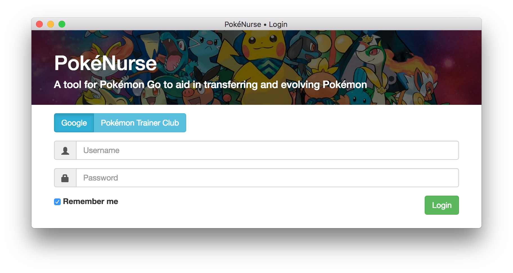
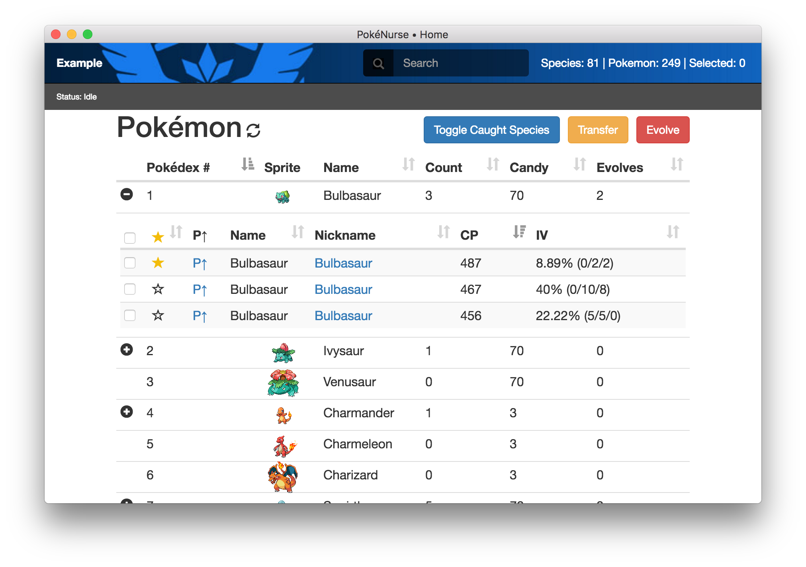
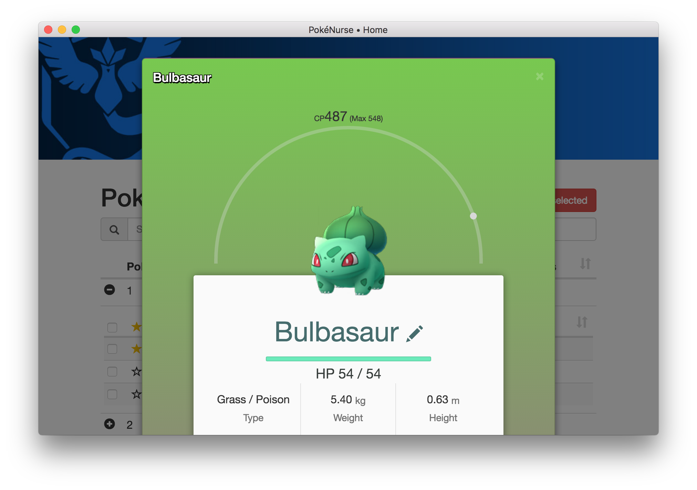

# PokeNurse

**PokéNurse** is a desktop application for Windows and Mac that allows you to manage your pokémon from Pokémon Go without the need for a mobile device. You can now favorite, transfer, and evolve from the comfort of your own home!

## Downloads for v2.3.0
You may view all the releases [here](https://github.com/vinnymac/PokeNurse/releases)
* [macOS](https://github.com/vinnymac/PokeNurse/releases/download/v2.3.0/PokeNurse.dmg)
* [Windows](https://github.com/vinnymac/PokeNurse/releases/download/v2.3.0/PokeNurse.exe)
* [Debian 32 bit](https://github.com/vinnymac/PokeNurse/releases/download/v2.3.0/PokeNurse-ia32.deb)
* [Debian 64 bit](https://github.com/vinnymac/PokeNurse/releases/download/v2.3.0/PokeNurse-x64.deb)
* [AppImage 32 bit](https://github.com/vinnymac/PokeNurse/releases/download/v2.3.0/PokeNurse-ia32.AppImage)
* [AppImage 64 bit](https://github.com/vinnymac/PokeNurse/releases/download/v2.3.0/PokeNurse-x64.AppImage)

## Examples

This project uses [Electron](http://electron.atom.io/) and [Node.js](https://nodejs.org/en/).  Criticism is welcome and encouraged.

## Features
* List and Sort Pokemon
    * Pokedex Number
    * Name
    * CP
    * IV
* Transfer Pokemon
* Evolve Pokemon
* Favorite/Unfavorite Pokemon
* PowerUp Pokemon
* Details - Evolutions, DPS, Energy, Moves, and more
* Renaming & Templated Renaming

## Templated Renaming
When renaming, it will automatically convert a name like `Bulba-[HP]` into `Bulba-140`.
* `[IV]` represents the IV percent of that pokemon: 40
* `[VI]` represents 100 minus the IV: 60
* `[ATT]`, `[DEF]`, `[STA]` represent attack, defense, and stamina, they will appear like: ⑨
* `[FAST]` is the damage of the quick move: 8
* `[CHARGE]` is the damage of the cinematic move: 40
* `[ENERGY]` is the amount of cinematic moves you can use before your energy runs out: ②
* `[HP]` is the max stamina: 140

Note: Only 12 characters can be used to rename a pokemon.

## Contributing
  All future pull request should be made to the **develop** branch.

    git clone https://github.com/vinnymac/PokeNurse
    cd PokeNurse
    git checkout develop
    yarn
    yarn run dev

## Releases

  Package for your platform

    yarn run package

  Package for all platforms

    yarn run package-all

## FAQ
1. **Will I be banned from pokemon go for using PokeNurse?**  
This app is meant to make pogo easier to manage. This is not a bot. We do not send location data. No one has ever been banned for using PokeNurse as far as we are aware. This doesn't mean you cannot be banned, if they somehow begin to detect API calls from pogobuf, then this may very well start happening, but that is the risk of using any of these third party tools right now that are not the original app.

2. **What is this `hashingKey` PokeNurse asks for?**  
The API Hashing service is a paid service that allows third party Pokémon GO developers to build awesome tools for the game. Most of this tools were free to use in the past but, because of some changes Niantic introduced, there's no way to use them anymore without a Hashing Key license. You can learn more about what they are and how much they cost [from this website](https://talk.pogodev.org/d/51-api-hashing-service-by-pokefarmer).

## Known Issues
* Google 2 Factor Authentication cannot be used. However you can use an [AppPassword](https://security.google.com/settings/security/apppasswords) instead.

## Credit
* [cyraxx](https://github.com/cyraxx) for [pogobuf](https://github.com/cyraxx/pogobuf) and [node-pogo-protos](https://github.com/cyraxx/node-pogo-protos)
* [AeonLucid](https://github.com/AeonLucid) for [POGOProtos](https://github.com/AeonLucid/POGOProtos)
* [PkParaíso](https://www.pkparaiso.com) for the [animated sprites](https://www.pkparaiso.com/xy/sprites_pokemon.php), licensed under [CC BY-NC-ND 3.0](https://creativecommons.org/licenses/by-nc-nd/3.0/)

## Legal
This Project is in no way affiliated with, authorized, maintained, sponsored or endorsed by Niantic, The Pokémon Company, Nintendo or any of its affiliates or subsidiaries. This is an independent and unofficial API for educational use ONLY. Using the Project might be against the TOS
